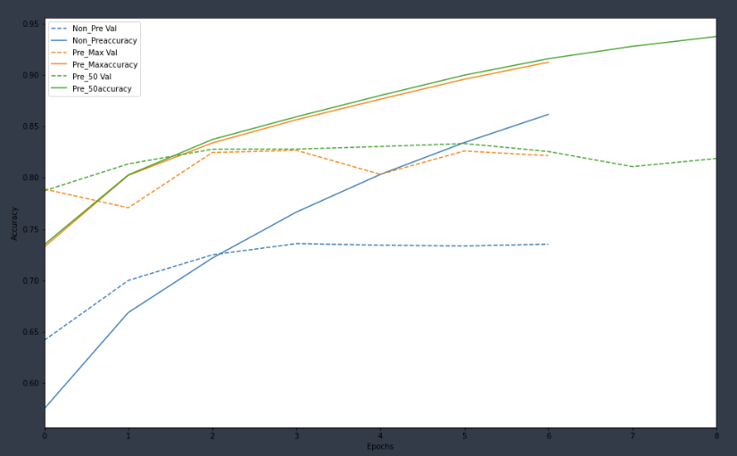
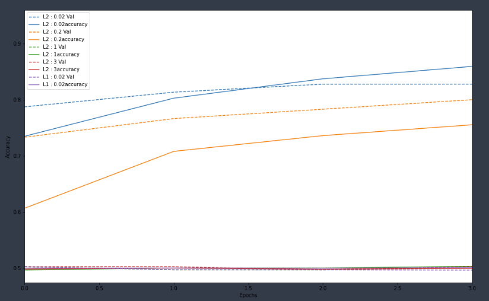
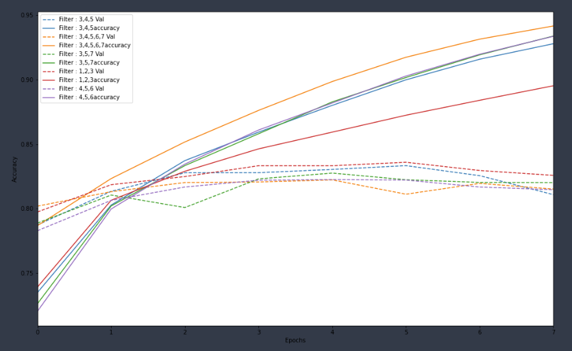
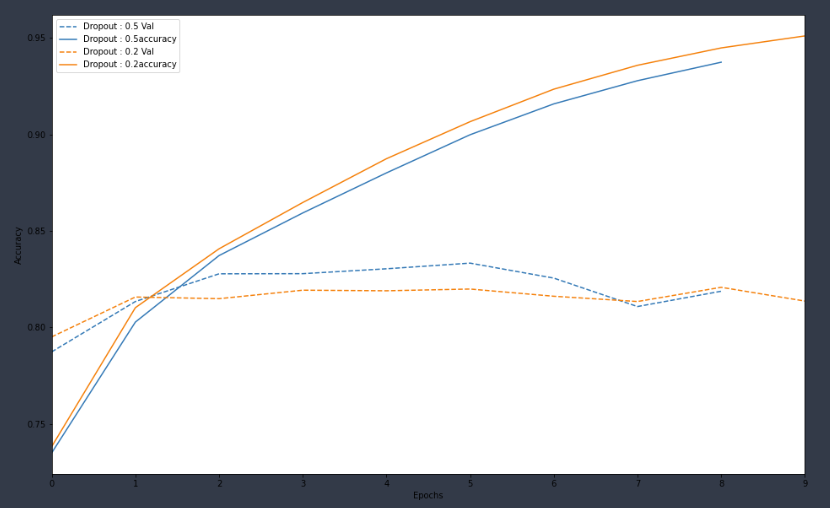
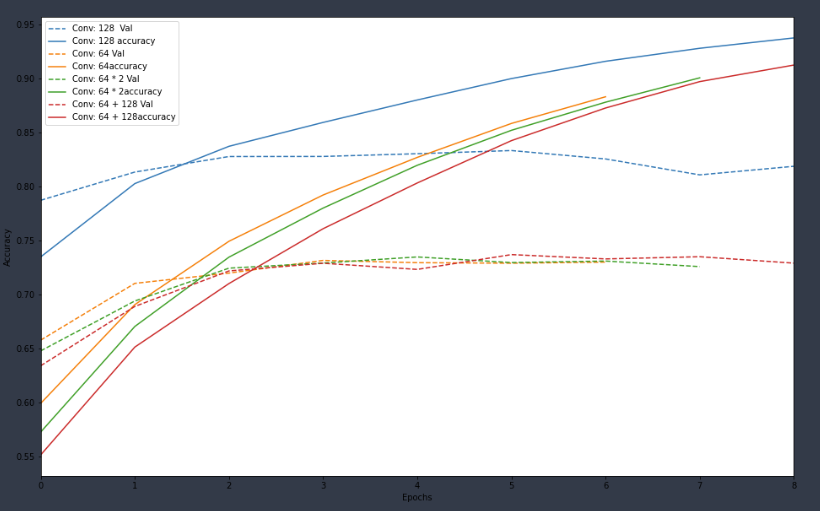
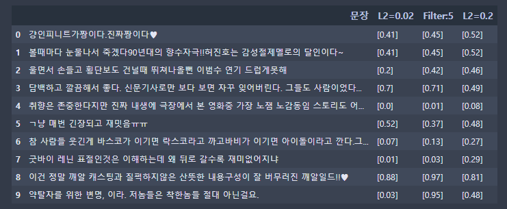

# CNN_Project

CNN for Sentence Classification (Naver Movie sentiment analysis) 
Train convolutional network for sentiment analysis. Based on "Convolutional Neural Networks for Sentence Classification" by Yoon Kim, [link](https://arxiv.org/pdf/1408.5882v2.pdf).

## CNN modeling with contextualized embedding
* language : python
* OS environment : windows
* IDE : Colaboratory

**사용법**
1. 본 repository를 로컬에 clone해주세요.
2. .ipynb 파일입니다.
3. 주피터 노트북이나 구글 코랩 환경에서 실행하기를 추천합니다.
4. 'prep for modeling' 폴더의 ratings_train.txt, ratings_test.txt을 xlsx로 저장해주세요.
5. xlsx 파일을 업로드한 후 pandas로 저장하세요.
6. pandas의 이름과 댓글이 있는 column명을 전처리 함수에 넣어주세요.
7. 함수의 output인 벡터를 label과 함께 학습시켜주면 됩니다.

## CNN modeling with mecab word2vec model
* language : python
* OS environment : macOS Catalina
* IDE : Jupyter Notebook

**How to use** 
1. clone repository to your local computer
2. recommend to convert file extension to .ipynb 
3. recommend to execute in jupyter notebook or google colaboratory environment
4. you can use raw ratings.txt or ratings_train.txt and ratings_test.txt in 'prep for modeling' folder
5. make word2vec model first with tokenize_mecab_300dim_w_sw.py file
6. make cnn model with word2vec model
7. you can use 'stopwords.xlsx' in 'prep for modeling' folder for removing stop words (in my case, there was no big difference in val_accuracy) 

**사용법**
1. 본 repository를 로컬에 clone해주세요.
2. .py 파일이므로 .ipynb 파일로 전환하여 사용하기를 추천합니다.
3. 주피터 노트북이나 구글 코랩 환경에서 실행하기를 추천합니다.
4. 'prep for modeling' 폴더의 전체 ratings.txt를 사용하거나 이미 나뉘어있는 ratings_train.txt, ratings_test.txt를 사용하시면 됩니다.
5. tokenize_mecab_300dim_w_sw.py 파일로 word2vec 모델을 먼저 생성해주세요.
6. 생성한 word2vec 모델로 cnn 모델을 만드시면 됩니다.
7. 'prep for modeling'폴더에 있는 'stopwords.xlsx' 파일을 불용어 제거를 위해 사용하셔도 됩니다. (저의 경우는 val_accuracy 면에서 큰 차이가 없었습니다.)

**updated model** 
2020.08.10 
preprocessing train/test sentences with mecab ([click to see the code](https://github.com/jyshin0926/CNN-for-sentence-classification/blob/master/CNN_word2vec_mecab300_update.ipynb)) 
val_accuracy : 0.8437  
val_loss : 0.4047 

2020.08.11 
adding l2 regularization ([click to see the code](https://github.com/jyshin0926/CNN-for-sentence-classification/blob/master/CNN_word2vec_mecab300_update_0.8468.ipynb)) 
val_accuracy : 0.8468  
val_loss : 0.4815 

## CNN modeling with fasttext model
* language : python
* OS environment : Windows10
* IDE : Jupyter Notebook

## 데이터 불러오기

1. #### FastText 

   - https://fasttext.cc/docs/en/crawl-vectors.html 에서 FastText 한국어 모델 파일 다운로드

   - gensim의 model 을 통해서 다운로드 받은 FastText 모델 불러오기

     

2. #### 네이버 영화 리뷰

   - https://github.com/e9t/nsmc에서 네이버 영화 리뷰 다운로드
   - 영화 리뷰와 라벨을 각각 분리

## 영화 리뷰 전처리

1. #### Okt

   - konlpy의 okt 라이브러리를 통해 어간을 추출하고, 조사,어미, 구두점을 제외
     - 보다 정확한 Tokenizing을 위함
     - Okt는 과거 트위터 형태소 분석을 위해 사용했기에 영화 리뷰와 같은 비정형데이터를 전처리 하기에 적합할 것이라 판단

   - 결측치 처리
     - 숫자, nan 값으로 이루어진 데이터를 '아'로 처리

       

2. #### 불용어처리

   - nltk의 stopwords 기능을 통해 불필요한 불용어 제거
     - stopwords = ['이', '있', '하', '것', '들', '그', '되', '수', '이', '보', '않', '없', '나', '사람', '주', '아니', '등', '같', '우리', '때', '년', '가', '한', '지', '대하', '오', '말', '일', '그렇', '위하']

## 토크나이즈

1. #### tokenize.fit_on_text() 

   - 빈도수를 기반으로 영화 리뷰에 등장한 단어들의 정수 인덱스 사전 생성

     

2. #### tokenizer.text_to_sequence()

   - 영화 리뷰를 사전에 생성한 단어들의 정수 인덱스 나열 형태로 변환 

     

3. #### pad_sequence()

   -  각 리뷰 내 최대 문장 길이를 설정하여 해당 길이에 못미치면 0을 채워넣고 , 초과하면 초과한 부분을 삭제

     - 현 모델에서는 최대 문장 길이 (max_len)을 가장 많은 단어를 포함했던 리뷰의 길이를 기준으로 삼아 47로 설정

     - padding='post' 를 통해 패딩값 0을 뒤쪽으로 채워넣도록 설정

       

4. #### Feature와 Target 설정

   - 상기 과정을 통해 정수의 배열로 변환된 영화 리뷰를 X_train으로, 라벨을 y_train으로 설정

- ### 전처리 이전 vs 전처리 이후

  - 전처리 이전의 Tokenizer

    - 최대 문장 길이 : 47 

    - embedding_matrix.shape :  (278263, 300)

  - 전처리 이후의 Tokenizer

    - 최대 문장 길이 : 67
    - embedding_matrix.shape :  (47190, 300)

## 워드 임베딩

1. #### Embedding Matrix 생성

   - Tokenizer를 사용해 생성된 단어의 정수 인덱스 사전과, FastText에 저장된 단어의 Embedding 값을 매칭
     - FastText의 단어 Embedding 차원 수는 300이므로, EMBEDDING_DIM을 300으로 설정

## 레이어 생성

1. #### Convolution Layer에 들어갈 Input_shape 생성

   - sequence_input = 리뷰의 최대 길이를 기준으로 

   - embedding_layer = 단어들의 정수 인덱스와 FastText에 저장된 embedding값을 매칭

     

2. #### N-gram Layer 생성 & 병합

   - N-gram을 기준으로 filter_size를 변경한 layer층을 누적

     - 논문에서 사용한 3, 4, 5의 N-gram을 구현하기 위해 filter_size를 3, 4, 5로 설정

   - tf.keras.layers.Concatenate를 통해 누적된 layer를 병합

     - axis=?

       - n차원으로 이루어진 layer에서

         -  axis = 0 : n차원을 기준으로 병합

         -  axis = 1 : n-1차원을 기준으로 병합

         -  axis = 2 :  n-2차원을 기준으로 병합

         -  axis = -1 : 가장 낮은 차원을 기준으로 병합

           

3. #### l2 규제, Dropout 적용

   - 논문에서 활용한 l2규제와 dropout을 사용하기 위함

   - kernel_regularizer=tf.keras.regularizers.l2(0.02) 를 통해 l2 규제 적용

     - l2( n ) 을 조절함으로써 l2규제 값을 조절 가능

   - x = tf.keras.layers.Dropout(0.5)(x) 를 통해 dropout 적용

     - Dropout( n ) 을 조절함으로써 dropout 값을 조절 가능

       

4. #### Dense layer로 통합

   - 리뷰가 긍정인지, 부정인지를 결정하는 2진 함수이기에 sigmoid 적용
     - 동일한 이유로 loss 또한 'binary_crossentropy'로 설정

   

5. #### Model compile & fit

   - validation_split = 0.2
     - 모델 검증 과정에서 training_set의 80%를 모델 학습에 사용하고, 20%를 검증 과정에 사용

- #### Early stopping method
  - monitor='val_accuracy'
    - monitor 값을 loss로 한다고 했을 때, 과적합을 적절하게 잡아내지 못함
    - validation_split을 사용했을 때 산출되는 val_accuracy를 기준으로 early stopping을 활용해야 과적합시 추가적인 수행을 차단할 수 있음.

## 파라미터 조절 결과 비교

### 전처리 / 최대길이 조절

- 전처리를 하지 않은 모델의 경우 Accuracy 와 Val_accuracy 다른 두 모델에 비해 0.1 가량 낮은 수치를 보였다.
- Max_len을 제한하지 않은 경우 Max_len을 제한한 경우와 유사한 Accuracy 와 Val_accuracy를 보였으나 6번째 epoch에서 Early Stopping 메서드에 의해 중단되었다.

### L2 / L1 규제 조절

- L2 규제를 0.02로 설정했을 때 가장 높은 Accuracy를 보였고, 규제값을 높게 설정했을 때와 L1 규제를 설정했을 때 낮은 Accuracy를 보였다.

### 필터 사이즈 조절

- Accuracy 값만을 비교했을 때 필터를 [3,4,5,6,7], 5개의 필터로 설정했을 때 가장 높은 Accuracy를 보였으나 Val_accuracy로 비교했을 때는 필터 사이즈 파라미터가 유의미한 차이를 도출해내지는 못했다.

### 드롭 아웃 조절

- Dropout을 0.2로 설정했을 때 Dropout을 0.5로 설정했을 때 보다 높은 Accuracy를 보였으나,  Val_accuracy 값에서 유의미한 차이를 도출해내지는 못했다.

### Conv 조절

- Conv1D를 128로 설정했을 때, 가장 높은 Accuracy를 보였다.

## 예측

- 영화리뷰의 10번째부터 20번째 리뷰의 모델별 예측치
- 사용한 모델  
-- 1. L2 = 0.02 / Filter = 3, 4, 5 / Dropout = 0.5 
-- 2. L2 = 0.02 / Filter = 3, 4, 5, 6, 7 / Dropout = 0.5 
-- 3. L2 = 0.2 /  Filter = 3, 4, 5 / Droupout = 0.5
